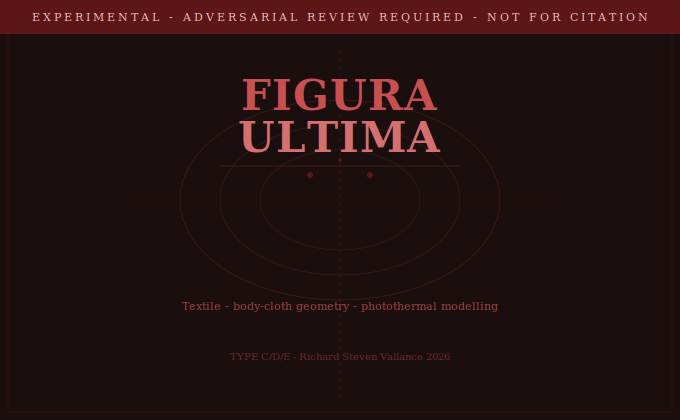

# ⚠ Figura Ultima — Experimental Repository ⚠

## ADVERSARIAL REVIEW REQUIRED — NOT FOR CITATION WITHOUT PEER REVIEW

**Author:** Richard Steven Vallance (Da Valenca)
**Parent Ecosystem:** [da-vinci-ultimatium](https://github.com/richievallance/da-vinci-ultimatium)
**Publication Branch:** [turin-shroud-white-paper](https://github.com/richievallance/turin-shroud-white-paper) — reserved for future controlled-hypothesis publication
**Constitutional Classification:** Experimental Synthesis
**Publication Status:** 🔴 Experimental / Under Adversarial Review
**Evidence Types:** TYPE C / TYPE D / TYPE E
**DOI Status:** No DOI will be assigned to this experimental repository

---

## Deposited Content

| Document | Description |
|---|---|
| `FIGURA_ULTIMA_Full_Thesis_RSV_2026.docx` | **Canonical full thesis** — 27,181 words, full academic apparatus, footnotes 1–36+, White Paper / Doctoral Research Monograph title |
| `FIGURA_ULTIMA_Thesis_RSV_2026.docx` | Short companion thesis — 15,469 words, no footnotes, public-facing |
| `experimental_mechanisms/` | 23 Mechanism chapter files (A–Y) — experimental working research substrate |
| `experimental_mechanisms/madrid_textile_evidence_note.md` | Madrid I textile evidence note |

*Note: Drive version of Full Thesis (1.7MB with embedded images) pending binary upload. Project version (183KB) deposited.*

---

## Central Hypothesis

Working hypothesis — not established finding:

Leonardo da Vinci created the Turin Shroud c.1476–1478 using an inverted plaster relief, glass slide lightbox, and Archimedes concave mirror flash. The central quantitative argument is the **7.1 scalar ratio** between the Vitruvian Man proportional module and the Turin Shroud cloth geometry.

Additional evidence strands: guild lineage (Verrocchio workshop), biographical gap (c.1476–1478), DNA falsifiability pathway, bilateral geometry analysis, photothermal mechanism, and 7.1 Fibonacci compound derivation.

---

## ⚠ Adversarial Review Notice

All findings in this repository are experimental syntheses. Specific limitations:

- The 7.1 scalar ratio requires independent geometric verification
- The photothermal mechanism hypothesis has not been experimentally replicated
- Carbon dating evidence is interpreted within a contested scholarly context
- No direct documentary evidence links Leonardo to the Shroud's creation
- Attribution claims require peer review before academic citation

**Do not cite findings from this repository as established scholarship.**

---

## Relationship to Turin Shroud White Paper

The `experimental_mechanisms/` folder contains the raw working substrate. The [turin-shroud-white-paper](https://github.com/richievallance/turin-shroud-white-paper) repository is reserved for a future unified controlled-hypothesis publication drawn from the strongest thesis sections only.

---

© 2026 Richard Steven Vallance. All Intellectual Property and Copyright Reserved.
*Da Valenca — Leonardo Project, United Kingdom*
